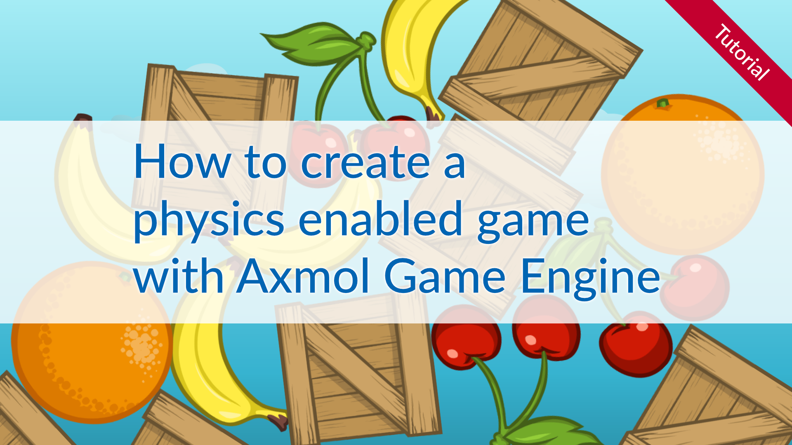

# How to create a physics enabled game with Axmol Game Engine

This is the example code for the Axmol Game Engine physics Tutorial.

You learn 

- How to enable the 2d pyhsics engine in Axmol
- How to create physics collision shapes 
- How to create a game scene using the shapes

Read the complete tutorial here:

[How to create a physics enabled game with Axmol Game Engine](https://www.codeandweb.com/physicseditor/tutorials/how-to-create-a-physics-enabled-game-with-axmol-game-engine)

